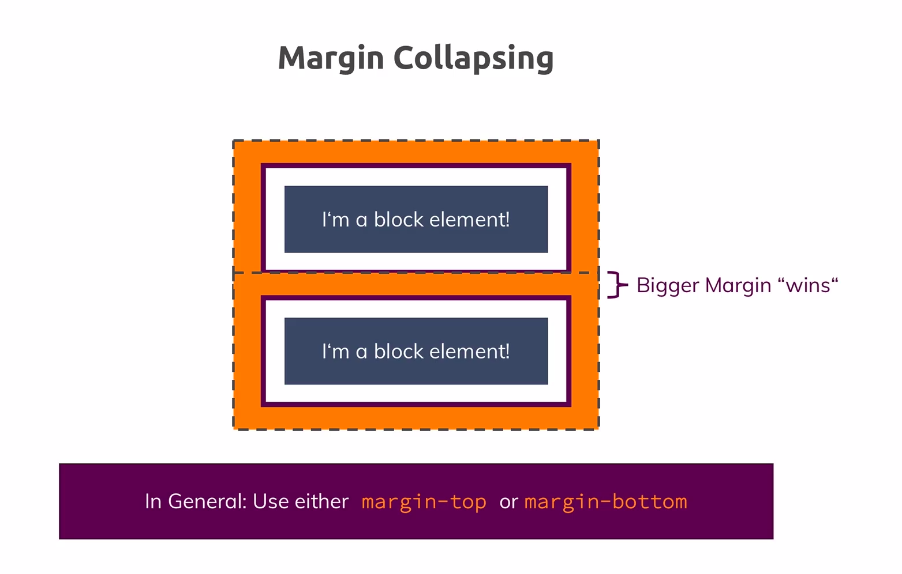
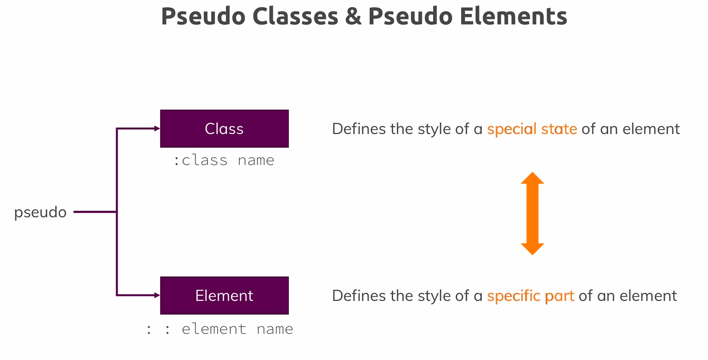
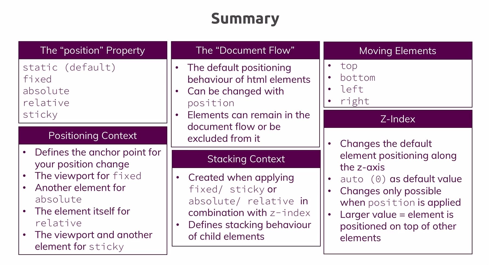

### Box model
If we set width: 500px, Is it for content or include padding/margin/border?
`box-sizing` property allow to set it
- content-box: only content is affected
- border-box: include content, padding and border

!! Block level element basically has `box-sizing: content-box` and doesn't inherit `box-sizing` from parent by browser default

### Outline
It is not included in box model. but working like border

## Display

### Display:inline-block
- become inline element but still can set margin and padding like block element

## Behavior depend on element

### Block element

- always take available width
- can set margin, padding

### Inline element

- width will be content width
- so set width doesn't effect
- cann't set marin, padding for up and bottom

### Display:inline-block
- become inline element but still can set margin and padding like block element
- **Inline-block** even care white space in editor. Broser consider there is white space which we can't measure. (So just remove bit more pixel)

### float is good for align image next text

### Shorthand properties

Recommend it as it is lean. When want to override, can use long property to keep other set properties

- combine values of multiple properties in a single property
- order doesn't matter

```css
  border: 2px black solid;
```

instead of

```css
  border-width: 2px;
  border-style: solid;
  border-color: black
```

## Margin collapsing [#](https://www.udemy.com/course/css-the-complete-guide-incl-flexbox-grid-sass/learn/lecture/9464964#overview)



## Pseudo class and property[#](https://developer.mozilla.org/en-US/docs/Web/CSS/Pseudo-classes)


## Syntax

- grouping

```css
.main-nav__item a:hover,
.main-nav__item a:active {
    color: white;
}
```

## Css class selectors vs ID selector
|CSS class Selectors|CSS ID Selectors|
|:-------:|:-------:|
|Re-usable| Only used once per page|
|Allow you to "mark" and name things for styling purposes only|Also got non-CSS meaning (g.g on-page link)|
|Most used selector type|Use if available anyways|

## Positioning


### Positioning Elements

- position: `static`, `absolute`, `relative`, `fixed` and `sticky`
- positioning context:
- inline or block element doesn't matter

#### Relative position
  It does get element out from not entire document flow but sibling level

#### Sticky
Working like relative and fixed as soon as we reach to the border

### Z-index

Affect to elements that has position proerty (not default position)

### Stacking context

If we have z index of parent and parent's sibling. The children z-index doesn't effect to its parent level.

### Summary of Positioning


# Useful resources and links

- CSS Box Model: https://developer.mozilla.org/en-US/docs/Learn/CSS/Introduction_to_CSS/Box_model
- box-sizing : https://developer.mozilla.org/en-US/docs/Web/CSS/box-sizing
- More on height & width: https://www.w3schools.com/css/css_dimension.asp
- The display  Property: https://developer.mozilla.org/en-US/docs/Web/CSS/display
- Pseudo Classes on the MDN: https://developer.mozilla.org/en-US/docs/Web/CSS/Pseudo-classes
- Dive deeper into Pseudo Elements: https://developer.mozilla.org/en-US/docs/Web/CSS/Pseudo-elements
- A discussion on "classes vs IDs": https://stackoverflow.com/questions/12889362/difference-between-id-and-class-in-css-and-when-to-use-it
- When is using !important  okay? => https://css-tricks.com/when-using-important-is-the-right-choice/


Document flow
Dom