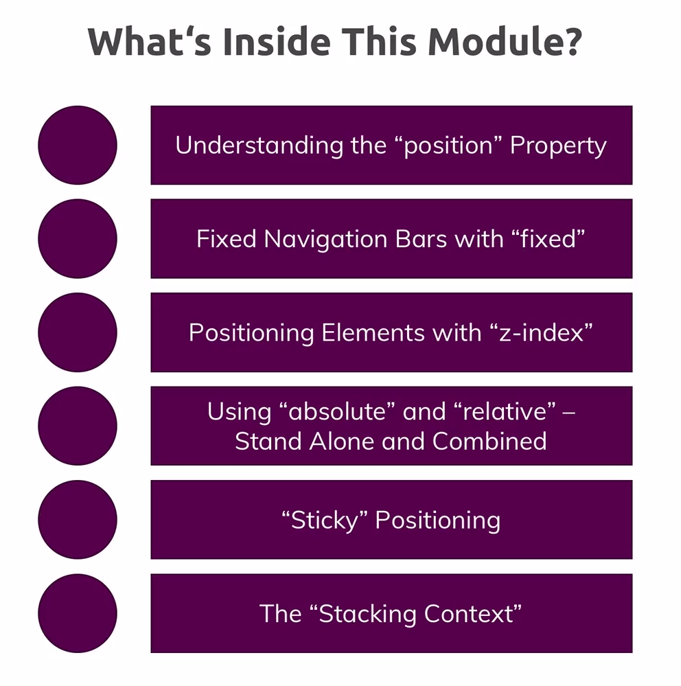
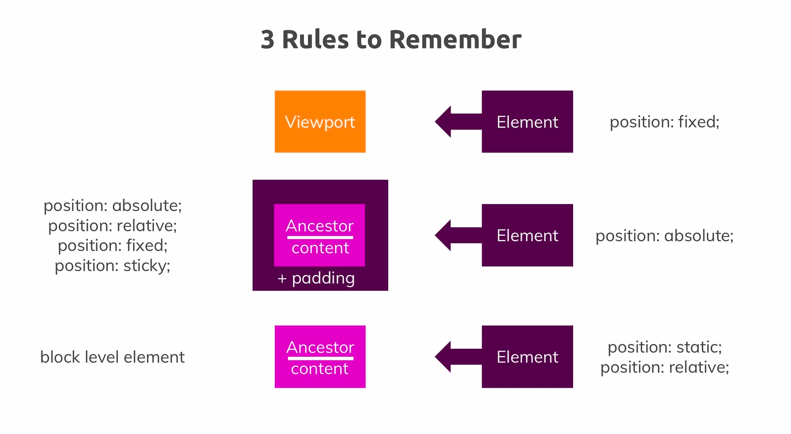

# CSS master course

This is from Academind udemy course.

!! NOTE: There are bunch of comments which are used through course. I keep it for reference.!!

### Box model
If we set width: 500px, Is it for content or include padding/margin/border?
`box-sizing` property allow to set it
- content-box: only content is affected
- border-box: include content, padding and border

!! Block level element basically has `box-sizing: content-box` and doesn't inherit `box-sizing` from parent by browser default

### Outline
It is not included in box model. but working like border

## Display

### Display:inline-block
- become inline element but still can set margin and padding like block element

## Behavior depend on element

### Block element

- always take available width
- can set margin, padding

### Inline element

- width will be content width
- so set width doesn't effect
- cann't set marin, padding for up and bottom

### Display:inline-block
- become inline element but still can set margin and padding like block element
- **Inline-block** even care white space in editor. Broser consider there is white space which we can't measure. (So just remove bit more pixel)

### float is good for align image next text

### Shorthand properties

Recommend it as it is lean. When want to override, can use long property to keep other set properties

- combine values of multiple properties in a single property
- order doesn't matter

```css
  border: 2px black solid;
```

instead of

```css
  border-width: 2px;
  border-style: solid;
  border-color: black
```

## Margin collapsing [#](https://www.udemy.com/course/css-the-complete-guide-incl-flexbox-grid-sass/learn/lecture/9464964#overview)
![]./assets/margin-collapsing.png)


## Pseudo class and property[#](https://developer.mozilla.org/en-US/docs/Web/CSS/Pseudo-classes)


## Syntax

- grouping

```css
.main-nav__item a:hover,
.main-nav__item a:active {
    color: white;
}
```

## Css class selectors vs ID selector
|CSS class Selectors|CSS ID Selectors|
|:-------:|:-------:|
|Re-usable| Only used once per page|
|Allow you to "mark" and name things for styling purposes only|Also got non-CSS meaning (g.g on-page link)|
|Most used selector type|Use if available anyways|

### Attribute selector


## Positioning



### Positioning Elements

- position: `static`, `absolute`, `relative`, `fixed` and `sticky`
- positioning context:
- inline or block element doesn't matter

#### Relative position
  It does get element out from not entire document flow but sibling level

#### Sticky
Working like relative and fixed as soon as we reach to the border

### Z-index

Affect to elements that has position proerty (not default position)

### Stacking context

If we have z index of parent and parent's sibling. The children z-index doesn't effect to its parent level.

### Summary of Positioning


## Images

To handle more about image, using background image is better. Downside is just document flow.

### Backgorund images


#### using multiple backgrounds
for transparent background or gradient
all considers as an image
```css
 background-image: url(), url(), linear-gradient(), url(), red;
```
- first will show up at top

#### gradient
```css
background-imgae: linear-gradient();
```


### Filter [#](https://developer.mozilla.org/en-US/docs/Web/CSS/filter)


### Image tag
Default behavior is image tag will not care the container's size but image size

- if container is (display: inline-block): relative height or width are working

### Summary of Image and background


- can stack filters

## Units
- related to view port: `vh`, `vmin`, `vmax`, `vw`
- rational with font: `rem`, `em`
- rational: `%`
- fixed: `px`


### Relations of display property



### Summary


# Align

- center: `margin: auto`

# Responsive


### Vieport meta tag

```html
<meta name="viewport" content="width=device-width, initial-scale=1.5 user-scalable, maximum-scale, maximum-scale=1.5">
```

### Media query
```css

@media (min-width: 40rem) and (orientation: landscape) {}
@media (min-width: 40rem), (orientation: portrait) {}
```

### Summary


# Styling forms

### outline

outline is comaptitible to padding. but it is applied after padding and boxshadow, so it doens't affect to them.

### summary


# Text and fonts

## System fonts

There is system font for like 'menu' and etc

## Custom styling

### font short hand[#](https://developer.mozilla.org/en-US/docs/Web/CSS/font)

Some values are infront of font size and font-family which is must required

```css
  font: italic small-caps 700 1.2rem/2 "AnonymousPro", sans-serif
  /*font: font-style font-variant font-weight font-size(must)/line-height  font-family(must) */
```

### Generic families and font families


### What will be displayed


### Properties

```css
 font-family: "Montserrat", "Verdana", sans-serif;
```

It uses a fallback system. First apply Montserrat, if there is no Montserrat, apply verdana, if there is no Verdana go to sans-serif (generic family)

### Font face

It will define default weight or effects. check in google fonts

- We need to import each font face, if want to use

### Importing custom fonts

```css
@font-face {
    font-family: "AnonymousPro";
    src: url("AnonymousPro-Bold.ttf") format("truetype"),
         url("AnonymousPro-Bold.ttf") format("woff"),
         url("AnonymousPro-Bold.ttf") format("woff2");
    font-weight: 700;
}
```

### Other properties for fonts

```css
  font-variant: small-caps;
  font-stretch: ultra-condensed;
```

- check browser competititvity with can i use dot com

#### text decoration

```css
  text-decoration: underline;
  text-decoration: overline wavy;
  text-decoration: line-through dotted red;
  text-decoration: none;
```

#### text shadow

It will makes a shadow behind of text as like as box shadow

```css
  text-shadow: 2px 2px 7px rgb(160, 153, 153);
```

#### Letter spacing

Increase space between letter

```css
  letter-spacing: 5px;
```

#### White space

Line brake place

```css
  white-space: nowrap;
  white-space: pre-wrap;
```

#### Line height

Line height is x times of font-size. So It is depend on used font-family size.

```css
line-height: 2;  /* recommended */
line-height: 32px;
line-height: 200%;  /* Can lead unexpected result in inherited font */
```

#### font-display

It is not good browser supported
```css
@font-face {
    font-family: "AnonymousPro";
    src: url("anonymousPro-Regular.ttf") format("truetype");
    font-display: swap;
}
```

- block-period is the time before custom styling added. There will be taken space for texts
- swap-period is applying the custom styles in fallback systems


### Summary


# Flex box

It is better way to make modern responsive web.

- It changes a way to display elements

## Flex container and flex items
- flex container is the element that we applyed `display: flex`
- flex items are children elements of the container

## Understanding flex box


### Understanding main axis vs. cross axis


### Align items and justify content


#### align-items

Align items along cross axis

- baseline value align items with the content's baseline not align along flex items

#### justify-content

Align items align main axis

### align content

When the second line of flex items are available, it effects immediately

### Flexbox and the Z-Index

In the position module we learned that adding the z-index  to an element only has an effect, if the position  property with a value different from static  was applied to this element.

One exception from this behaviour is flexbox: Applying the z-index  to flex-items (so the elements inside of the flex-container) will change the order of these items even if no position  property was applied.


# Useful resources and links

- CSS Box Model: https://developer.mozilla.org/en-US/docs/Learn/CSS/Introduction_to_CSS/Box_model
- box-sizing : https://developer.mozilla.org/en-US/docs/Web/CSS/box-sizing
- More on height & width: https://www.w3schools.com/css/css_dimension.asp
- The display  Property: https://developer.mozilla.org/en-US/docs/Web/CSS/display
- Pseudo Classes on the MDN: https://developer.mozilla.org/en-US/docs/Web/CSS/Pseudo-classes
- Dive deeper into Pseudo Elements: https://developer.mozilla.org/en-US/docs/Web/CSS/Pseudo-elements
- A discussion on "classes vs IDs": https://stackoverflow.com/questions/12889362/difference-between-id-and-class-in-css-and-when-to-use-it
- When is using !important  okay? => https://css-tricks.com/when-using-important-is-the-right-choice/
- The background  Property: https://developer.mozilla.org/en-US/docs/Web/CSS/background
- Styling Images: https://www.w3schools.com/css/css3_images.asp
- Filters: https://developer.mozilla.org/en-US/docs/Web/CSS/filter
- Styling SVG: https://developer.mozilla.org/en-US/docs/Web/SVG/Tutorial/SVG_and_CSS
- classList : https://developer.mozilla.org/en-US/docs/Web/API/Element/classList
- More about device sizes: https://bjango.com/articles/min-device-pixel-ratio/
- Media queries theory: https://developer.mozilla.org/en-US/docs/Web/CSS/Media_Queries
- Styling Form Elements: https://developer.mozilla.org/en-US/docs/Learn/HTML/Forms/Styling_HTML_forms
- Styling a `<select>`  Element: https://stackoverflow.com/questions/1895476/how-to-style-a-select-dropdown-with-css-only-without-javascript
- Web Safe Fonts: https://www.cssfontstack.com/
- Google Fonts: https://fonts.google.com/

# Words
Document flow
Dom