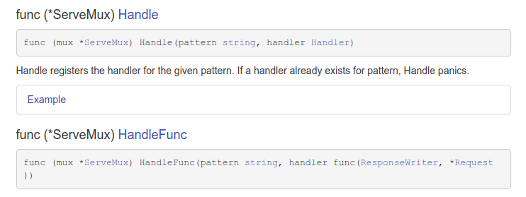

# ServeMux

How to do routing. Server different things based on different url

```
type ServeMux
  func NewServeMux() *ServeMux
  func (mux *ServeMux) Handle(pattern string, handler Handler)
  func (mux *ServeMux) HandleFunc(pattern string, handler func(ResponseWriter, *Request))
  func (mux *ServeMux) Handler(r *Request) (h Handler, pattern string)
  func (mux *ServeMux) ServeHTTP(w ResponseWriter, r *Request)  // means ServeMux is implicitly implemented handler
```

### HandleFunc [#goDoc](https://godoc.org/net/http#HandlerFunc)
type HandlerFunc is its own type and implicitly [implemented type Handler.](https://godoc.org/net/http#HandlerFunc.ServeHTTP)

```
func (mux *ServeMux) HandleFunc(pattern string, handler func(ResponseWriter, *Request))
```

HandleFunc registers the handler function for the given pattern.



- Handle get a `type Handler` as a param
- HandleFunc get a `type func` as a param

**[check code](./01_understanding-net-http-ServeMux/02_NewServeMux/main.go)**


## Third party library [httpRouter](./03_third-party-serveMux/README.md)
  It has to match exact path


## Synonymous Terms
All interchangeable

1. Synonymous
- url
- multiplex
- router
- mux
- servermux
- request router
- http
- http router
- http request router