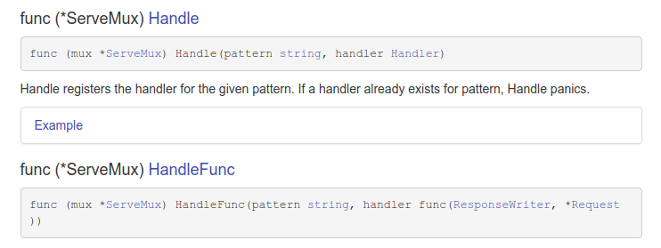

# ServeMux

How to do routing. Server different things based on different url

```
type ServeMux
  func NewServeMux() *ServeMux
  func (mux *ServeMux) Handle(pattern string, handler Handler)
  func (mux *ServeMux) HandleFunc(pattern string, handler func(ResponseWriter, *Request))
  func (mux *ServeMux) Handler(r *Request) (h Handler, pattern string)
  func (mux *ServeMux) ServeHTTP(w ResponseWriter, r *Request)  // means ServeMux is implicitly implemented handler
```

### HandleFunc [#goDoc](https://godoc.org/net/http#HandlerFunc)
type HandlerFunc is its own type and implicitly [implemented type Handler.](https://godoc.org/net/http#HandlerFunc.ServeHTTP)

```
func (mux *ServeMux) HandleFunc(pattern string, handler func(ResponseWriter, *Request))
```

HandleFunc registers the handler function for the given pattern.



- Handle get a `type Handler` as a param
- HandleFunc get a `type func` as a param

**[check code](./01_understanding-net-http-ServeMux/02_NewServeMux/main.go)**


## Third party library [httpRouter](./03_third-party-serveMux/README.md)
  It has to match exact path


## How to make middleware [#](https://medium.com/@chrisgregory_83433/chaining-middleware-in-go-918cfbc5644d)
```
package main
import (
    "fmt"
    "net/http"
)
func IndexHandler(w http.ResponseWriter, r *http.Request) {
    fmt.Fprintf(w, "Hello Index!")
}
func main() {
    http.HandleFunc("/", LogMiddleware(IndexHandler))
    http.ListenAndServe(":8080", nil)
}
```

## Pre hook or post hook[#](https://github.com/JoergReinhardt/gorilla/issues/2)
```
var router *mux.Router

func httpInterceptor(w http.RequestWriter, req *http.Request) {
    // do some stuff before... check redis, etc
    router.ServeHTTP(w, req)
    // do some stuff after... put things in to redis, etc
}

func main() {
    // set up your desired things on router here...

    http.HandleFunc("/", httpInterceptor)
}

you could even intercept the writes to the ResponseWriter by passing mux's 
ServeHTTP your own type that implements the ResponseWriter interface.
```

## Synonymous Terms
All interchangeable

1. Synonymous
- url
- multiplex
- router
- mux
- servermux
- request router
- http
- http router
- http request router