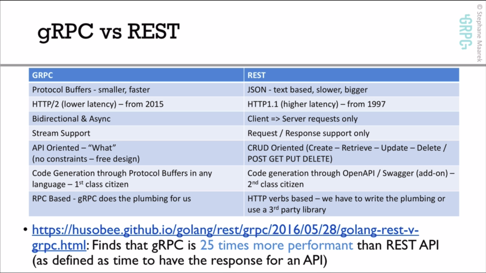
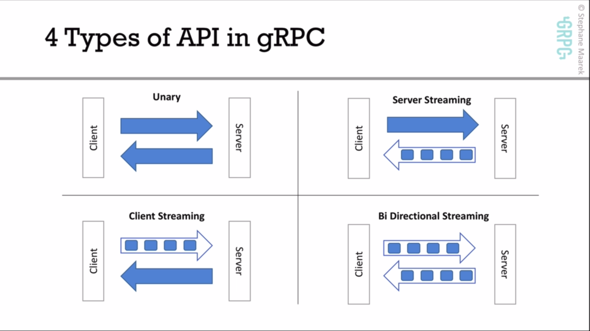
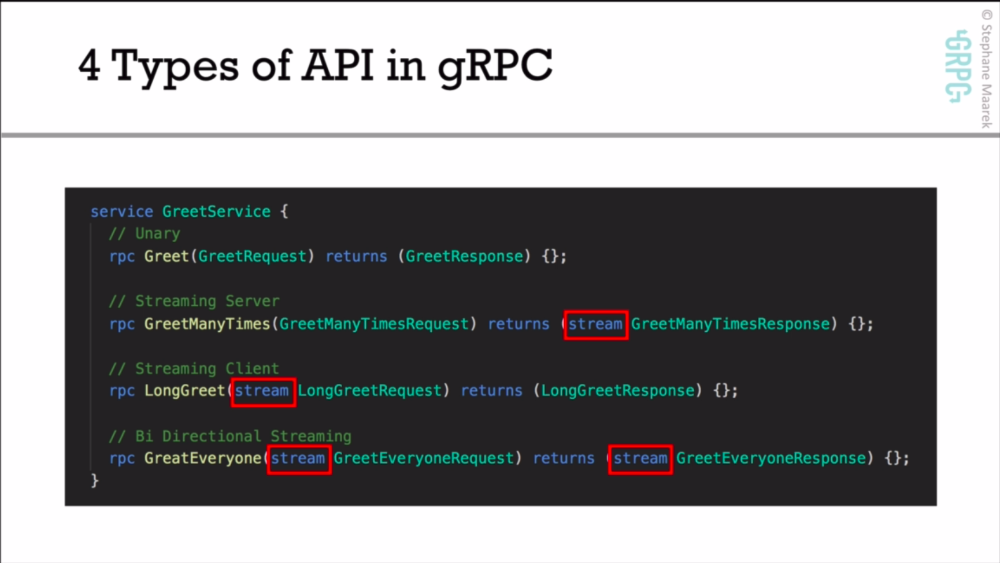
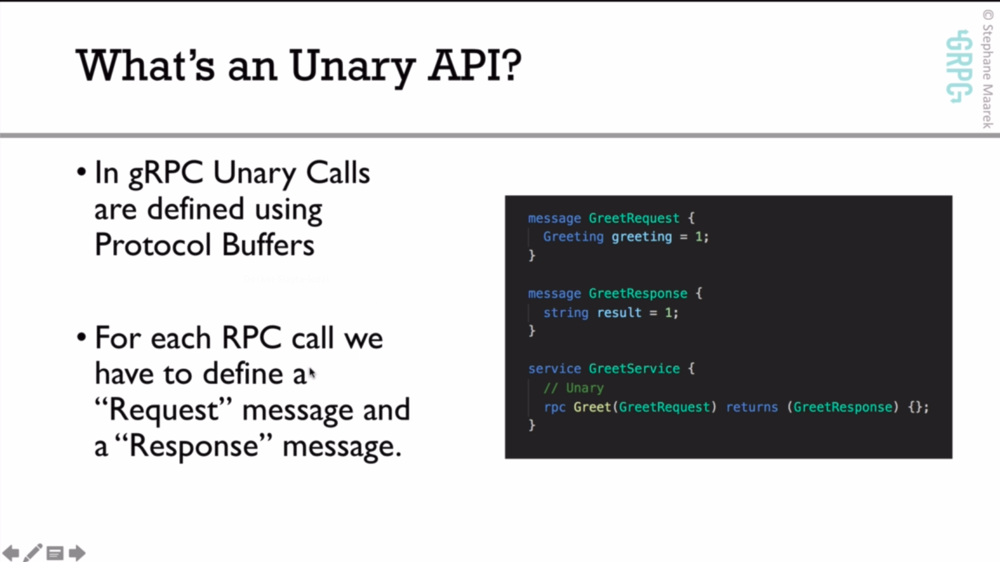
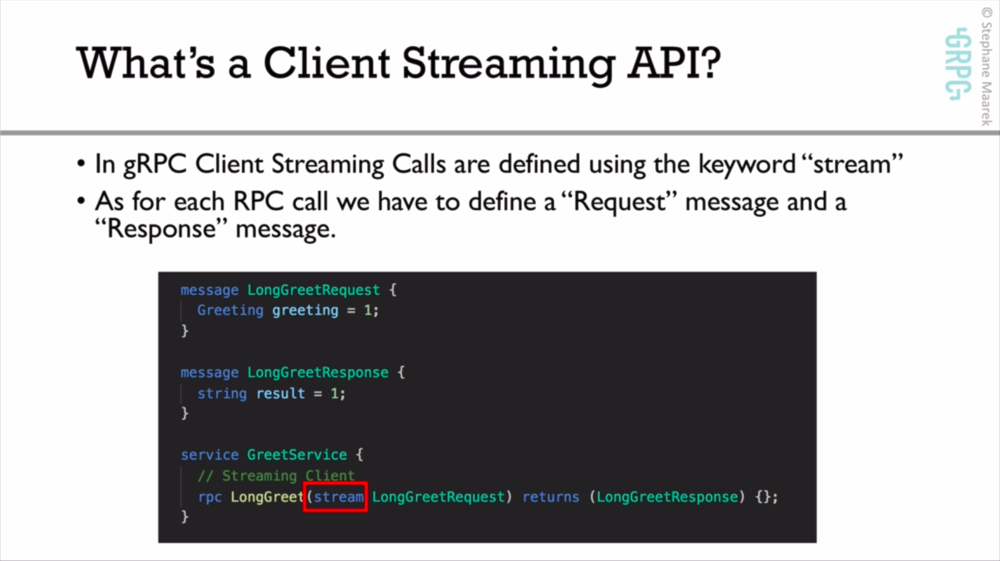
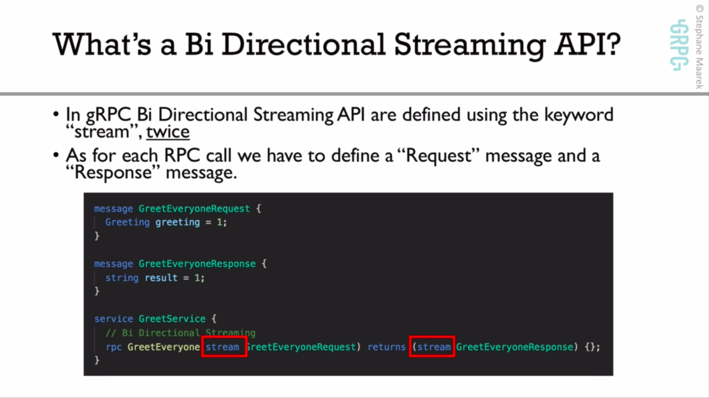

## Whats GRPC [#](./whatsGRPC.md)
## Whats ProtocolBuffer [#](./whatsPB.md)
## Whats ProtocolBuffer [#](./deepDiveGRPC.md)

## HTTP2
- is binary
- can push messages in parallel over the same TCP
- support header compression
### HTTP/1.1 works
- release 1997
- opens a new TCP connections to a server at each request
- Nowadays a web page load 80 assets on average
- No header compressed
So Http1.1 need open 80 TCP conncections and close with 80 plain text head

## gRPC
- support for streaming APIs
- gRPC is API oriented, instead of resource oriented like REST
- uses HTTP/2
- Easy code definition in over 11 languages

#### Unary api

### Scalability in gRPC
- gRPC severs are asynchronous by default
### Security in gRPC
- cross language security
- SSL security built in
- By default gRPC strongly advocates for you to use SSL
- can also provide authentication

### gRPC vs REST

## GRPC APIS

### What's an Unary API
- traditional API look like (HTTP REST)
- Unary RPC calls are the basic Request/Response that everyon is familiar

### What's a server streaming API
It can be used when
- the client will send one message to the server and will receive many responses from the server, possibly an infinte number
- When the serveer needs to send a lot of data (big data)

### What's a client streaming API
- The client will send `many` message to the server and will receive one response from the server (at any time)
- Streaming client ar weill suited for
  - When the client needs to send a lot of data
  - When the server processing is expenisve and should happen as the client sends data
  - When the client needs to `PUSH` data to the serer without really expecting a response

### What's a Bi Directional Streaming API?
- The client will send `many` message to the serer and will receive `many` responses from the server
- The number of requests and responses does not have to match
- Suited for
    - when teh client and the server needs to send a lot of data **asynchronously**
    - `Chat` protocol
    - Long running connections

